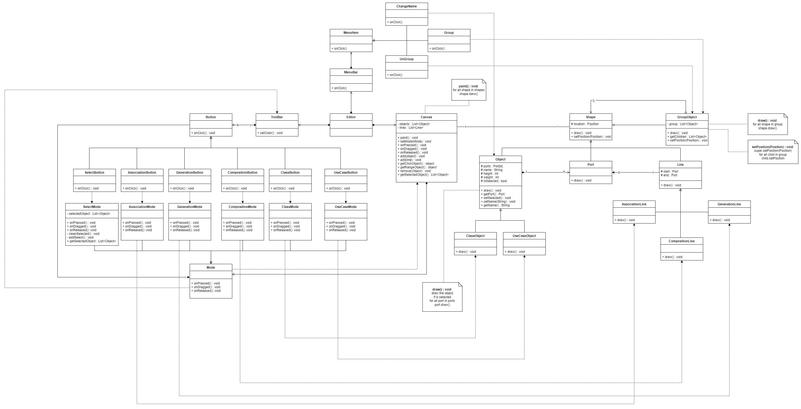

# UML-Editor-With-OO
For final Project, and more OO

## Basic Feature
- [ ] GUI of the UML Editor
- [ ] Object Creation
- [ ] Connection Line Creation
- [ ] Show the Port
- [ ] Object Selection
  - Single Object
  - Multi Objects
- [ ] Objects Group and Ungroup
- [ ] Move Objects
- [ ] Rename Objects

## Bonus Feature(More User-friendly)
- [ ] Show the Selection Range on Mouse Dragged
- [ ] Move the Object Animation

## UML
### Class Diagram ver 1.0

### Sequence Diagram ver 1.0
#### case A

#### case B

#### case C

#### case D

#### case E

#### case F

